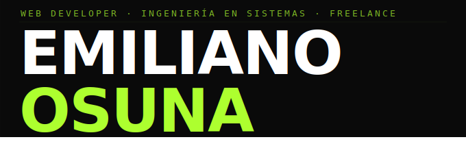

<div align="center">

**`Ingeniería en Sistemas · TecNM Campus Tepic · Desarrollador Freelance`**

[](https://emilianoosuna.com)
[](https://linkedin.com/in/emiliano-osuna-langarica-aa2075363)

</div>

---

Soy ingeniero en sistemas en formación y desarrollador freelance. Construyo software desde distintos frentes: aplicaciones web, herramientas de escritorio, compiladores, sistemas de gestión. No me quedo en un solo dominio porque la ingeniería en sistemas, bien entendida, no funciona así.

Mi enfoque en cualquier proyecto es el mismo: entender el problema primero, diseñar la solución, construirla con criterio. Sin improvisar a mitad del camino.

---

## `~/stack`

```json
{
  "web":       ["React", "TypeScript", "Tailwind CSS", "Framer Motion", "Supabase", "Vite"],
  "backend":   ["Python", "Node.js", "Express"],
  "sistemas":  ["Java", "C", "SQL Server", "PostgreSQL"],
  "infra":     ["Cloudflare Pages", "Vercel", "GitHub Actions"],
  "diseño":    ["Figma"]
}
```

---

## `~/proyectos`

| Proyecto | Stack | Descripción |
|---|---|---|
| **[Stathmos](https://github.com/EmilianoOsuna/Stathmos.web)** | React · Supabase · PWA | Sistema de gestión para taller automotriz. Órdenes, inventario, clientes. |
| **[MatrixCore](https://github.com/EmilianoOsuna/MatrixCore)** | Java | Compilador/intérprete para un lenguaje de matrices con analizador léxico y parser LL(1). |
| **[SmartMouth](https://github.com/EmilianoOsuna/SmartMouth)** | Python | Herramienta de voz a texto con limpieza de muletillas via LLM. |
| **[HBD2Hanna](https://github.com/EmilianoOsuna/HBD2Hanna)** | React | Proyecto personal. |
| **[OurMap](https://github.com/EmilianoOsuna/OurMap)** | React | Proyecto personal. |

---

## `~/actualmente`

Cursando Ingeniería en Sistemas en el TecNM, con materias como Redes de Computadoras, Bases de Datos y Autómatas. Al mismo tiempo trabajando con clientes en LATAM, construyendo productos propios y explorando cómo integrar IA de forma útil en flujos de desarrollo reales.

---

<div align="center">

*Todo lo que construyo tiene una motivación de fondo.*
*Esa motivación tiene nombre: **Hanna**.*
*Mi novia, que me recuerda todos los días por qué vale la pena hacer las cosas bien.*

</div>
